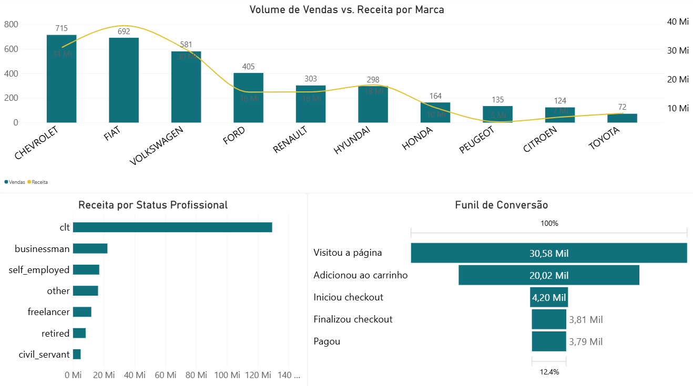
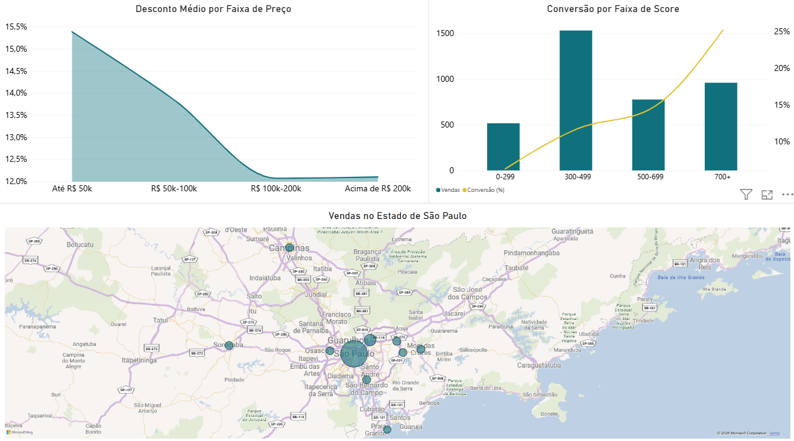

# 🚗 Análise de Vendas de Veículos com SQL e Power BI

> 💼 Projeto de portfólio desenvolvido para demonstrar habilidades em análise de dados com SQL e Power BI. Faz parte dos meus estudos em Ciência e Análise de Dados.

Análise do funil de vendas e do comportamento de compra de um marketplace fictício de veículos, usando PostgreSQL para consulta e tratamento dos dados e Power BI para visualização.

## 🎯 Objetivo

Entender como os clientes avançam pelo funil de compra (desde a visita ao site até o pagamento), identificar quais marcas e perfis de cliente geram mais receita, e mapear a distribuição geográfica das vendas.

## 🔍 O que foi feito

- 🗄️ Modelagem e consulta de um banco de dados relacional no PostgreSQL (tabelas de funil, clientes, produtos e lojas)
- 🧮 Escrita de queries SQL com joins, agregações e CTEs para responder perguntas de negócio
- 🔗 Conexão direta do Power BI ao PostgreSQL via instrução SQL nativa
- 📊 Construção de um dashboard interativo em duas páginas, cobrindo funil de conversão, perfil de cliente, marcas, geografia e política de desconto

## 🛠️ Tecnologias utilizadas

- SQL
- Power BI

## 📈 Dashboard

### Página 1

### Página 2

## 💡 Principais insights

- O funil apresenta sua maior queda entre "Adicionou ao carrinho" e "Iniciou checkout", onde a maioria dos leads desiste da compra.
- Chevrolet lidera em volume de vendas, mas a Fiat gera mais receita — volume e faturamento nem sempre andam juntos.
- Clientes CLT respondem pela maior parte da receita, seguidos de empresários e autônomos.
- A conversão sobe de forma consistente conforme o score de crédito do cliente aumenta, mas o maior volume de vendas em número absoluto vem da faixa de score intermediária (300-499), não da mais alta.
- O desconto médio concedido diminui conforme a faixa de preço do veículo aumenta — carros de até R$ 50 mil têm desconto médio de ~15%, contra ~12% nos veículos acima de R$ 200 mil.
- As vendas estão fortemente concentradas na Grande São Paulo, com destaque para a capital, Guarulhos e Campinas.
